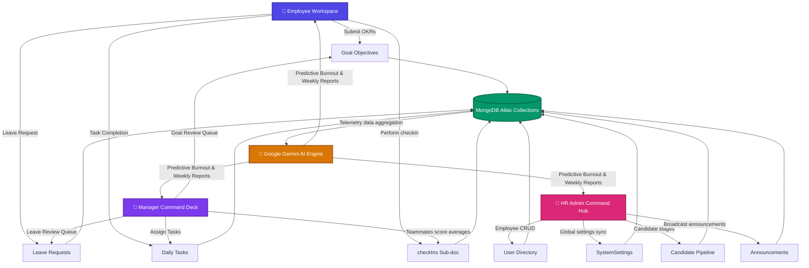

# GoalSphere AI — Enterprise Workforce Intelligence & Goal Tracking Platform

GoalSphere AI is an advanced, corporate-scale goal-tracking, dynamic performance management, and AI-driven organizational health intelligence portal. Engineered as a high-performance SaaS engine, GoalSphere AI bridges real-time workforce communications, continuous objectives checking, and predictive neural network recommendations. It empowers companies to align strategic goals, automate manager workflows, and forecast operational health.

---

## 🏗️ System Architecture & Technology Overview

### 1. HIGH-LEVEL ARCHITECTURE OVERVIEW

GoalSphere AI is structured as a decoupled, multi-tiered enterprise architecture designed to handle complex relational schemas and high-throughput real-time events. 

```
┌────────────────────────────────────────────────────────────────────────┐
│                        FRONTEND PRESENTATION LAYER                     │
│                        Next.js 15 (App Router)                         │
├───────────────────┬───────────────────────────────┬────────────────────┤
│   Employee Desk   │     Manager command hub       │  HR Admin Command  │
└─────────┬─────────┴───────────────┬───────────────┴──────────┬─────────┘
          │ HTTP / REST             │ HTTP / REST              │ Socket.IO
          ▼                         ▼                          ▼
┌────────────────────────────────────────────────────────────────────────┐
│                           BACKEND API ENGINE                           │
│                          Node.js & Express.js                          │
├────────────────────────────────────────────────────────────────────────┤
│  • JWT & Google OAuth auth services                                    │
│  • Gemini AI core integration pipeline                                 │
│  • Socket.IO real-time event dispatcher                                │
│  • Cloudinary file asset gateway                                       │
└─────────┬─────────────────────────┬──────────────────────────┬─────────┘
          │ Mongoose                │ SDK                      │ Secure CDN
          ▼                         ▼                          ▼
┌───────────────────┐     ┌───────────────────┐      ┌───────────────────┐
│  DATABASE ENGINE  │     │   AI COMPONENT    │      │    ASSETS CDN     │
│   MongoDB Atlas   │     │  Google Gemini    │      │    Cloudinary     │
└───────────────────┘     └───────────────────┘      └───────────────────┘
```

The system components seamlessly communicate through established design patterns:
*   **Decoupled client-server coordination**: The Next.js presentation frontend executes asynchronous API calls (`fetch` layer with a global interceptor) to the Express.js backend for CRUD events and state updates.
*   **Real-time bidirectional event pipeline**: A dedicated state-synchronized WebSocket loop (via Socket.IO) acts as an active telemetry broadcast layer, updating managers instantly on check-in activities, task completions, and leave submissions.
*   **Stateless REST endpoints**: High-value transactions, such as employee registrations, performance analytics generation, and candidate pipeline tracking, are executed over JSON API endpoints secured with stateless authorization middleware.

---

### 2. ROLE-BASED WORKFLOW & ARCHITECTURE DIAGRAM

GoalSphere AI aligns its operational layers through strict access control, segmented workspaces, and continuous data aggregation pipelines:



#### Detailed Role Responsibilities and Permissions

*   **Employee**:
    *   *Permissions*: View personal workspace, submit personal Objectives and Key Results (OKRs), perform progress check-ins, request leave ledgers, complete assigned daily tasks, and chat with team leads.
    *   *Responsibilities*: Keep goal values aligned with actual accomplishments, update tasks promptly, and leverage AI insights to prevent productivity burnout.
*   **Manager**:
    *   *Permissions*: Oversee direct report rosters, review and approve teammate goal proposals, process leave requests, assign targeted tasks with priorities, and view team productivity indices.
    *   *Responsibilities*: Provide continuous feedback, support struggling teammates identified by predictive analytics, and maintain operational efficiency.
*   **HR / Admin**:
    *   *Permissions*: Access administrative directory control panels (Create, Read, Update, Delete employees), manage system-wide settings, direct candidate stage movements, broadcast company updates, and review organization-wide bell curves.
    *   *Responsibilities*: Keep system settings aligned with security standards, manage the hiring pipeline, and govern company policy.

---

### 3. TECHNOLOGY STACK JUSTIFICATION

| Layer | Technology | Purpose & Justification |
| :--- | :--- | :--- |
| **Frontend Core** | Next.js 15 (App Router) | Enables lightning-fast Server-Side Rendering (SSR) and client-side page updates with strict folder structure and built-in API routing capabilities. |
| **UI Components** | React 19 & shadcn/ui | Leverages declarative, state-driven interfaces with accessible, pre-styled, modular component libraries built on Radix UI primitives. |
| **Styling Engine** | Tailwind CSS | Direct utility-first inline class design, promoting highly responsive layouts, unified design tokens, and sleek transitions. |
| **Motion Physics** | Framer Motion | Drives advanced glassmorphic micro-animations, layout shifts, step transition fades, and dynamic modal entries. |
| **Backend Core** | Node.js & Express.js | An asynchronous event-driven JavaScript server environment providing high-performance routing, custom middleware integration, and low latency. |
| **Database** | MongoDB Atlas | A cloud-native document database perfect for nesting complex hierarchical employee profiles, candidate logs, and checking histories. |
| **Authorization** | JSON Web Tokens (JWT) | Provides stateless, cryptographically secure verification headers for protected API communication. |
| **Federated Login**| Google OAuth 2.0 | Enables seamless corporate Single Sign-On (SSO) with enterprise email domains. |
| **AI Processing** | Google Gemini API | Powers GoalSphere's weekly intelligence reports, sentiment check-in analysis, predictive analytics, and conversational voice queries. |
| **WebSocket Layer**| Socket.IO | Establishes persistent full-duplex channels to stream workspace announcements, leaf requests, and chat events in real-time. |
| **Asset CDN** | Cloudinary | Cloud service for optimization, transformations, and low-latency delivery of employee avatars and assessment files. |
| **Data Graphs** | Recharts | Renders highly interactive responsive SVG SVG charts, departmental goal distributions, and bell curve data. |
| **Client Deployment**| Vercel | Fully integrated serverless hosting for Next.js, with built-in CDN caching and pull-request preview support. |
| **API Hosting** | Render / Railway | Cloud container environments that support continuous deployment, web socket persistent connections, and easy environment setups. |

---

### 4. FRONTEND ↔ BACKEND FLOW

The GoalSphere AI communication lifecycle guarantees data persistence, real-time sync, and fluid client-side states:

```
┌──────────────────┐               ┌──────────────────┐               ┌──────────────────┐
│  Client View     │  API Call     │  Express Server  │  Database Query  │  MongoDB Atlas   │
│  (Next.js App)   ├──────────────►│  (REST API /     ├─────────────────►│  (Collections)   │
│                  │  (JWT Header) │   Socket.IO)     │                  │                  │
│                  │◄──────────────┤                  │◄─────────────────┤                  │
│                  │  JSON Payload │                  │  Mongoose Docs   └──────────────────┘
└────────┬─────────┘               └────────┬─────────┘
         │                                  │
         │ WebSocket Sync                   │ AI Generation Engine
         ▼                                  ▼
┌──────────────────┐               ┌──────────────────┐
│  Socket.IO Loop  │               │  Gemini AI API   │
│  (Real-Time      │               │  (Prompt Engine) │
│   Broadcasting)  │               └──────────────────┘
└──────────────────┘
```

*   **API Communication**: The client utilizes standard HTTPS requests. A custom `FetchInterceptor` automatically appends JWT Bearer tokens to the request headers and handles unified server error routing.
*   **Data Processing**: Data transformations are kept minimal on the client. The Express server queries MongoDB via Mongoose, validates payloads, and formats models into clean JSON schemas for UI consumption.
*   **Real-time Synchronization**: When state changes occur (e.g. creating a task, updating a candidate stage, submitting leave), the server processes the record, then emits an event via Socket.IO to instantly synchronize active clients.
*   **State Management**: React state updates are executed optimistically on the client to ensure instant, zero-lag UI feedback, with fallback logic in place to handle API errors.

---

### 5. AUTHENTICATION & ACCESS CONTROL ARCHITECTURE

GoalSphere AI uses a robust authentication standard to govern secure access:

```
    [ User Logs In ]
           │
     ┌─────┴──────────┐
     ▼                ▼
[ Password Form ]   [ Google OAuth SSO ]
     └─────┬──────────┘
           ▼
    [ Backend Verify ]
           │
           ├─► (Success) ──► [ Generate JWT Token ]
           │                        │
           │                        ▼ (Append Role Claim)
           └───────────────► [ Dashboard Route Protection ]
                                    │
                                    ├─► /employee ──► (Employee Only)
                                    ├─► /manager  ──► (Manager Only)
                                    └─► /hr       ──► (HR Admin Only)
```

*   **Cryptographic Password Hashing**: Standard passwords are secure from the start, hashed with a strong salt rounds config via `bcryptjs` during account setup.
*   **SSO Integration**: Google OAuth 2.0 integration securely matches user profiles and handles authentications directly against trusted company email domains.
*   **Route Protection**: Next.js custom route checks block unauthorized navigation attempts, redirecting unauthenticated or mismatched sessions back to the login gateway.
*   **Role-Based Access Control (RBAC)**: All protected API routes verify claims in JWT payloads, preventing role escalation attacks.

---

### 6. AI & PREDICTIVE ANALYTICS ARCHITECTURE

GoalSphere AI utilizes Google Gemini's advanced language models to generate real-time metrics and explainable recommendations:

```
┌──────────────────┐         ┌──────────────────┐         ┌──────────────────┐
│ Aggregated Data  │ Prompt  │ Gemini AI Engine │ JSON    │ Live Dashboard   │
│ (Goals, check-ins│────────►│ (Structured      │────────►│ (Insight Cards & │
│  & task metrics) │         │  Prompt Schema)  │         │  Simulators)     │
└──────────────────┘         └──────────────────┘         └──────────────────┘
```

*   **Structured Prompts**: Our backend gathers goals, progress values, check-in histories, and task counts to build highly detailed context strings for the Gemini prompt engine.
*   **AI Insight Cards**: Generates contextual advice, warnings about delays, and actionable metrics tailored to each user role.
*   **Workforce Simulators**: Uses generative modeling to simulate organizational changes, forecast the impacts of new hires, and predict key metrics.
*   **Predictive Analytics**: Evaluates goals progress and task completion trends to predict potential issues and offer mitigation strategies before timelines are impacted.

---

### 7. HOSTING & DEPLOYMENT ARCHITECTURE

GoalSphere AI is deployed across high-availability cloud platforms to ensure production readiness:

| Infrastructure | Platform | Purpose |
| :--- | :--- | :--- |
| **Frontend Host** | **Vercel** | Delivers Next.js static and dynamic assets globally with instant edge caching. |
| **Backend Host** | **Railway / Render** | Houses the Express API container, supporting persistent WebSocket connections. |
| **Database Host**| **MongoDB Atlas** | Managed database cluster with automatic failover, scaling, and backups. |
| **Assets Host** | **Cloudinary** | Serves static assets, document uploads, and employee profiles over a global CDN. |

*   **Production Readiness & Scalability**: Deployed using decoupled pipelines, letting you scale frontend or backend services independently based on server load.
*   **Cost-Efficient & Hackathon-Ready**: Leverages free/pay-as-you-go developer tiers across Vercel, Render, and MongoDB Atlas, providing a professional environment with zero upkeep cost.

---

## 📌 System Architecture Diagram

```
                                    +--------------------+
                                    |     Web Browser    |
                                    | (Client Frontend)  |
                                    +---------+----------+
                                              |
                                              | HTTPS / WebSockets
                                              v
                                    +---------+----------+
                                    |    API Gateway     |
                                    | (Railway Container)|
                                    +----+----+----+-----+
                                         |    |    |
                   +---------------------+    |    +---------------------+
                   |                          |                          |
                   v                          v                          v
        +----------+----------+    +----------+----------+    +----------+----------+
        |   MongoDB Database  |    |   Cloudinary CDN    |    |   Google Gemini AI  |
        |   (Mongoose Schemas)|    |   (Media Storage)   |    |   (Analytics Core)  |
        +---------------------+    +---------------------+    +---------------------+
```

---

## 📌 ER Diagram

```
  [User] 1 ──── * [Goal]
    │               │ 1
    │               └─── * [Check-In]
    │
    ├─ * [Task]
    ├─ * [Leave]
    └─ * [Message] (Sender / Recipient)
```

---

## 📌 Deployment Architecture

```
  [ Next.js Source ] ──────► [ Vercel Build Pipeline ] ──────► [ Global Edge Network ]
                                                                      │
                                                                      ▼ (API Requests)
  [ Express Source ] ──────► [ Railway Container Run ] ──────► [ Server API Endpoint ]
                                                                      │
                                    ┌─────────────────────────────────┴─────────────────────────────────┐
                                    ▼                                   ▼                               ▼
                          [ MongoDB Atlas ]                  [ Cloudinary CDN ]               [ Gemini AI API ]
```
